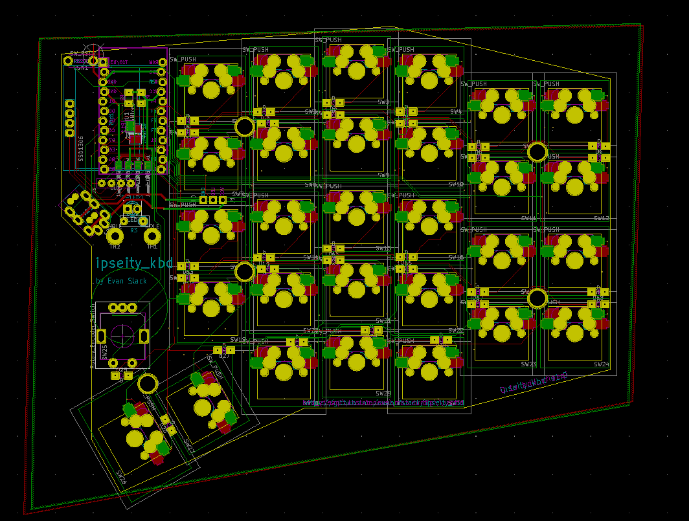

# Ipseity Keyboard

This is a custom split keyboard PCB design. It features hotswap keyswitch support, dual rotary encoders, 64x128 OLED display, I2C communication between halves through a TRRS jack, and individually addressable LEDs support. 

Each PCB is completly reversible so that only one PCB design can be used for both the right and left halves. 

